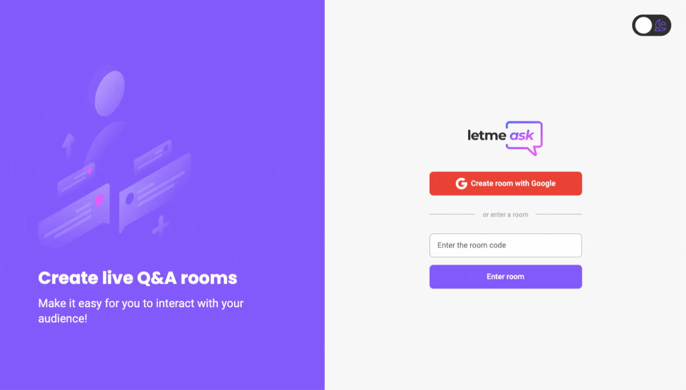

<h1 align="center"></h1>
 <h1 align="center">
 
 </h1>

 <p>This project was made during the event <strong>Next Level Week</strong> by <a href="https://rocketseat.com.br/">Rocketseat</a>.
 Create a live Q&A chat room and make it easy for you to interact with your audience!</p>
 <br/>

## 🧩 Tecnologies

<ul> 
  <li><a href="https://reactjs.org/">React JS</a><br> </li>
  <li><a href="https://www.typescriptlang.org/">Typescript</a><br></li>
  <li><a href="https://firebase.google.com/">Firebase</a><br></li>
  <li><a href="https://sass-lang.com/">Sass</a><br></li>
  <li><a href="https://reactrouter.com/">React Router Dom</a><br></li>
 </ul>
</li>
<br>

## 🌱 Getting started

<p>You can access the deployed project by clicking <a href="https://letmeask-76f0b.web.app/">here</a>.<br>
<br>
Also, you can clone the repository and access the files. You will need to have installed <a href="https://nodejs.org/en/">Node.js</a> and have an account on <a href="https://firebase.google.com/">Firebase</a> for the Realtime Database purposes.
</p>

```bash
$ git clone https://github.com/eduardaterra/letmeask.git
```

<p>To initiate the project, you have to access the file, install the dependencies and start with <a href="https://www.npmjs.com/">NPM.</a></p>

```bash
$ cd letmeask

$ npm install

$ npm start
```

<p>The app will be available in your browser by the address <a href="http://localhost:3000">http://localhost:3000</a></p>
